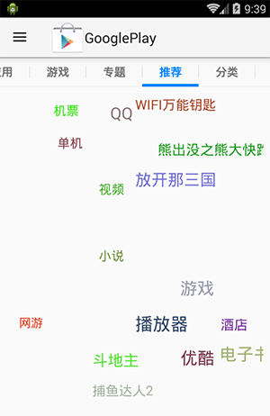
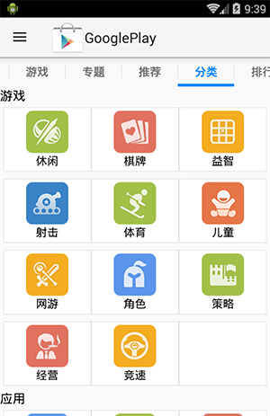
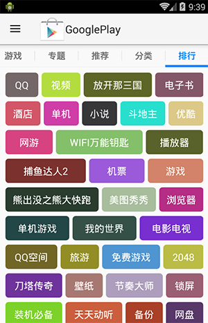

# 谷歌电子市场

## 运行项目

- 编码UTF-8

- 导入GooglePlayTeach, android-support-v7-appcompat, XUtilsLibrary, GooglePlayTeach关联appcompat和xutils两个库项目

- 导入WebServer并运行, 这是手机端的服务器项目, 服务器需要资源文件包WebInfos, 需要将WebInfos导入到sdcard根目录,模拟器选中Genymotion, 或者真机. GenyMotion导入文件夹方式: 进入Genymotion桌面, 拖拽文件夹到桌面, 系统会自动拷贝到sdcard/Download文件夹下, 然后移动到sdcard根目录 

## BaseFragment

> 共性

- 加载中
- 加载失败
- 数据为空
- 加载成功

FragmentPagerAdapter是PagerAdapter的子类, 如果viewpager的页面是fragment的话,就继承此类
而且必须要复写的方法只有 getCount() 和 getItem() , 不需要再复写 instantiateItem() 和 destroyItem() 方法了

主界面中每一个Tab都对应一个Fragment, 而每一个Fragment都会在显示的时候创建并使用 LoadingPage 来加载并调整界面中的显示内容

    public static class Person {
        public static Person p1 = new Person();
        public static Person p2 = new Person();
        public static Person p3 = new Person();
    }

	// 枚举就相当于上面这种形式的简化
    public enum  Person {
        p1,
        p2,
        p3;
    }

	// 枚举也是可以添加参数的
    public enum Person {
        p1(10),
        p2(12),
        p3(13);

        private int age;
        private Person(int age){ // 枚举的构造方法必须是私有的, 而且默认也是私有的
            this.age = age;
        }

        public int getAge() {
            return age;
        }
    }
	
	// 类似于普通类的如下形式
    public static class Person {
        public static Person p1 = new Person(10);
        public static Person p2 = new Person(12);
        public static Person p3 = new Person(13);

        public Person(int age) {

        }
    }

## LoadingPage的封装

状态:

- 未加载
- 加载中 
- 加载失败 
- 数据为空 
- 加载成功

LoadingPage 的整体逻辑: 一进入界面就请求后台加载数据, 根据请求返回的结果状态加载显示对应的布局.

但是在具体实现上: 先初始化好各个状态的布局, 然后请求服务器加载数据, 根据这个请求返回的结果显示对应的状态布局. (其中 加载成功的布局是由使用者来实现的)

其实这两种逻辑都是可以的, 后者从代码角度来说排版更好看一点!

LoadingPage 请求后台数据成功时, 显示ListView的布局, 但是和ListView的"加载更多"的状态是没有什么关系的

待优化:

 LoadingPage 的加载数据的逻辑的封装

   
	-LoadingPage.java
	/**
     * 异步加载数据
     */
    public void loadData() {
        if (mCurrentState != STATE_LOADING) { // 如果当前没有加载, 就开始加载数据
            mCurrentState = STATE_LOADING;

            new Thread() {
                @Override
                public void run() {

                    final ResultState resultState = onLoad();// onLoad()被Fragment实现,内部调用Fragment#onLoad()方法
                    //主线程中更新UI
                    UIUtils.runOnUIThread(new Runnable() {
                        @Override
                        public void run() {
                            if (resultState != null) {
                                mCurrentState = resultState.getState();// 网络加载结束后,更新网络状态

                                // 根据最新的状态来刷新页面
                                showRightPage();
                            }
                        }
                    });
                }
            }.start();
        }
    }

	- HomeFragment
	
	// 运行在子线程,可以直接执行耗时网络操作
    @Override
    public LoadingPage.ResultState onLoad() {
        //请求网络
        mData = new ArrayList<>(); // 每次按返回键退出程序重新进来时, 原有的data数据会保留, Activity虽然会重新创建一个,但是Fragment会恢复, 所以原来的数据会保留
        for (int i = 0; i < 30; i++) {
            mData.add("item " + i);
        }

        return LoadingPage.ResultState.STATE_SUCCESS;
    }

	问题:
	1. 我认为这种仅仅把LoadingPage中在子线程中请求加载数据的逻辑抽象出来由宿主HomeFragment来实现,这种方式不太好. 应该把整个请求服务器的逻辑抽象出来, 而不仅仅是子线程中那部分逻辑. 
		原因就是:1) 职责更加清晰, 不会出现一个请求数据功能分层两部分来完成. 2) 我们封装的网络请求框架也应该类似那种开源框架一样, 子线程中请求数据,然后在主线程中回调方法. 如果使用上面这种封装, 那我们的请求框架仅仅完成的是子线程中请求数据的部分

## ListView Adapter的封装
BaseAdapter中 使用多类型的ItemView时要注意 定义的条目类型(getItemViewType())要从0开始依次递增, 否则AbsListView中就会报ArrayIndexOutOfBoundsException(数组越界异常)

加载更多:
1) 给ListView设置滑动监听, 当滑动到最底部时, 调用加载更多方法.
2) 当Adapter中显示加载更多ItemView时, 调用加载更多方法

这里选择第二种方式, 因为这本身就是Adapter的封装, 而且也可以减少ListView的职责

## 网络封装

- 请求网络获取数据
- 缓存机制(写缓存和读缓存)
- 解析数据

> 请求网络前, 先判断是否有缓存, 有的话就加载缓存

	// android api23之后, 使用HttpClient
	android {
	    ...
	    useLibrary 'org.apache.http.legacy'
	}

## 自定义布局使得ImageView的长宽按固定比例显示图片
思路: 我们并不继承ImageView, 而是继承FrameLayout, 让FrameLayout的宽高按比例显示, 而内部的内容匹配父布局即可.

好处: 1. 适用性更广, 内部View可以是任何View, 而不仅仅是ImageView; 2. 继承FrameLayout要比继承ImageView简单

## CategoryFragment
该界面显示的是GridView形式的,但是实现上是使用ListView来实现的, 个人感觉不太好, 应该使用GridView来实现. 个人认为之所以使用ListView来实现是为了使用封装的Adapter实现了对多类型item的封装以及使用

## 首页中的应用详情界面
1. 该界面中的安全模块和截图模块应该动态来实现; 不应该事先写死, 使用隐藏与否来实现.
2. 截图模块应该实现点击全屏显示的形式. 原理: 重新启动一个Activity, 传入截图的url数组和当前点击的position至新的Activity,然后在ViewPager中进行全屏显示. 有时间在开发

    /**
     * 获取7行的TextView的高度
     */
    private int getShortHeight() {

        // 模拟一个TextView, 属性以及内容和实际的TextView一模一样,且设置最大行数为7行, 计算该虚拟TextView的高度, 从而知道TVDES在展示7行时应该多高

        // 获取tvDes测量的宽度. 这里我们预想是要获取tvDes显示出来时的真实的宽度. 但这里也有一个坑:getShortHeight() 在 setViewData() 中也有调用,但此时界面并没有绘制出来, 所以此时使用getMeasuredWidth()获取的值为0
        // 但是如果我们先使用 tvDes.measure(0, 0); 测量的话, 然后 getMeasuredWidth()值为 1680, getMeasuredHeight()值为38, 结果很奇怪, 其实这个就是tvDes在一个无限大的屏幕中单行显示的结果.
        // 原因就是: 测量的规则为 MeasureSpec.UNSPECIFIED(即值为0) 即按照tvDes 想要的大小来测量, 没有任何限制. 所以tvDes的测量宽度并没有被限制为不超过屏幕的宽度, 所以tvDes在真正绘制出来时就得需要二次甚至多次测量
        int width = tvDes.getMeasuredWidth(); // 这个是在点击事件中调用的, 界面已经完整的绘制出来了, 所以使用 tvDes.getWidth() 也是可以的

        // Log.d("Liu", "width: "+width); // width: 736
        // Log.e("Liu", "width: "+tvDes.getWidth()); // width: 736

        TextView textView = new TextView(UIUtils.getContext());
        textView.setText(tvDes.getText());// 设置文字一样
        textView.setTextSize(TypedValue.COMPLEX_UNIT_SP, 14);// 文字大小一致
        // 最大行数为7行.
        // 注意, 这里设置了最大行数为7行, 若是内容不足7行时, 显示出来的理论上就是真实的行数. 但是若是直接在 setViewData()中调用的话(即布局文件刚加载完成后立即调用),无论内容多少,获取到的永远就是7行的高度
        // 所以: 在 setViewData() 中把 getShortHeight() 放在了消息队列中, 按次序来执行
        textView.setMaxLines(7);

        // todo: 2018/1/12  这里一定不能直接使用 measure(0,0) 来测量, 因为我们并没有给该textView 设置 layout 相关的属性, 所以无法测量
        // 解决方法就是: 直接手动指定 MeasureSpec 参数, 这个参数中包含了大小和规则. layout_width 和 layout_height 最终就是解析成适当的 MeasureSpec 参数, 然后传递给 setMeasuredDimension() 方法中
        // textView.measure(0, 0);
        // int measuredHeight = textView.getMeasuredHeight();
        // Log.e("Liu", "measuredHeight: "+measuredHeight); // measuredHeight: 38
        // Log.e("Liu", "Height: "+tvDes.getHeight()); // Height: 236. 7行时的高度

        // 宽不变, 确定值, match_parent.
        // 注意, 这里一不小心就会掉入坑中: 这里的width的值会影响到getShortHeight()最终的测量结果, 若是tvDes没有绘制出来,此时width的值就为0, 就相当于TextView内容是单列排列,而最终getMeasuredHeight()的值就是TextView7行的高度(除非内容就只有几个字,连7行都没达到)
        int widthMeasuredSpec = View.MeasureSpec.makeMeasureSpec(width, View.MeasureSpec.EXACTLY);
        int heightMeasuredSpec = View.MeasureSpec.makeMeasureSpec(2000, View.MeasureSpec.AT_MOST);// 高度包裹内容, wrap_content;当包裹内容时,参1表示尺寸最大值,暂写2000, 也可以是屏幕高度

        // 开始测量
        textView.measure(widthMeasuredSpec, heightMeasuredSpec);

        Log.e("Liu", "measuredHeight: " + textView.getMeasuredHeight());  //measuredHeight: 236. 发现和实际的TextView的7行时的高度一样

        return textView.getMeasuredHeight();
    }

BaseAdapter中 使用多类型的ItemView时要注意 定义的条目类型(getItemViewType())要从0开始依次递增, 否则AbsListView中就会报ArrayIndexOutOfBoundsException(数组越界异常)

 SystemClock.sleep(2000); 线程休眠. 内部就是调用 Thread.sleep()方法. 只不过一个是属于android提供,一个是属于java提供

        /**
         * 这是java提供的一个线程池,用于并发操作
         * Creates a new {@code ThreadPoolExecutor} with the given initial
         * parameters.
         *
         * @param corePoolSize the number of threads to keep in the pool, even
         *        if they are idle(空闲的), unless {@code allowCoreThreadTimeOut} is set
         *        核心数, 线程池中至少要保持的线程的数量
         * @param maximumPoolSize the maximum number of threads to allow in the
         *        pool
         *        最大线程数量
         * @param keepAliveTime when the number of threads is greater than
         *        the core, this is the maximum time that excess(超过,多余的) idle threads
         *        will wait for new tasks before terminating(结束).
         *        当线程数大于核心数时，这是多余空闲线程在终止之前等待新任务的最长时间。
         * @param unit the time unit for the {@code keepAliveTime} argument
         *        keepAliveTimed的时间单位
         * @param workQueue the queue to use for holding tasks before they are
         *        executed.  This queue will hold only the {@code Runnable}
         *        tasks submitted by the {@code execute} method.
         *        用于在执行任务之前保存任务的队列。当调用execute()方法后,Runnable实际上是先进入队列等待,最后被执行
         * @param threadFactory the factory to use when the executor
         *        creates a new thread
         *        创建线程的工厂
         * @param handler the handler to use when execution is blocked
         *        because the thread bounds and queue capacities are reached
         *        线程异常处理策略
         * @throws IllegalArgumentException if one of the following holds: 
         *         {@code corePoolSize < 0} 
         *         {@code keepAliveTime < 0} 
         *         {@code maximumPoolSize <= 0} 
         *         {@code maximumPoolSize < corePoolSize}
         * @throws NullPointerException if {@code workQueue}
         *         or {@code threadFactory} or {@code handler} is null
         */
        if (executor == null) {
            executor = new ThreadPoolExecutor(corePoolSize, maximumPoolSize, keepAliveTime, TimeUnit.SECONDS,
                    new LinkedBlockingQueue<Runnable>(), Executors.defaultThreadFactory(), new ThreadPoolExecutor.AbortPolicy());
        }

===================================================================================

## 项目介绍 ##

## 项目部署流程 ##

- 1.客户端:googlePlay(UTF-8编码)

- 2.服务端工程:WebServer 

- 3.服务端工程运行到手机上面去,webInfo文件夹必须拷贝到手机内置sd卡路径下

- 4.工程需要通过actionBar去管理应用的头(Title),关联actionBar所在的库文件,android-support-v7-appcompat

- 5.关联Xutils的库文件

- 6.运行项目前, 必须先启动WebServer, 保证可以从服务器获取数据

## 框架搭建 ##

- 自定义Application

		/**
		 * 自定义Application
		 * 
		 * @author Kevin
		 * 
		 */
		public class BaseApplication extends Application {
		
			private static Context context;
			private static int mainThreadId;
			private static Handler handler;
		
			@Override
			public void onCreate() {
				super.onCreate();
				context = getApplicationContext();
				mainThreadId = android.os.Process.myTid();// 获取当前主线程id
				handler = new Handler();
			}
		
			public static Context getContext() {
				return context;
			}
		
			public static int getMainThreadId() {
				return mainThreadId;
			}
		
			public static Handler getHandler() {
				return handler;
			}
		}

- UIUtils封装

		/**
		 * 工具类, 专门处理UI相关的逻辑
		 * 
		 * @author Kevin
		 * 
		 */
		public class UIUtils {
		
			public static Context getContext() {
				return BaseApplication.getContext();
			}
		
			public static int getMainThreadId() {
				return BaseApplication.getMainThreadId();
			}
		
			public static Handler getHandler() {
				return BaseApplication.getHandler();
			}
		
			/**
			 * 根据id获取字符串
			 */
			public static String getString(int id) {
				return getContext().getResources().getString(id);
			}
		
			/**
			 * 根据id获取图片
			 */
			public static Drawable getDrawable(int id) {
				return getContext().getResources().getDrawable(id);
			}
		
			/**
			 * 根据id获取颜色值
			 */
			public static int getColor(int id) {
				return getContext().getResources().getColor(id);
			}
		
			/**
			 * 根据id获取尺寸
			 */
			public static int getDimen(int id) {
				return getContext().getResources().getDimensionPixelSize(id);
			}
		
			/**
			 * 根据id获取字符串数组
			 */
			public static String[] getStringArray(int id) {
				return getContext().getResources().getStringArray(id);
			}
		
			/**
			 * dp转px
			 */
			public static int dip2px(float dp) {
				float density = getContext().getResources().getDisplayMetrics().density;
				return (int) (density * dp + 0.5);
			}
		
			/**
			 * px转dp
			 */
			public static float px2dip(float px) {
				float density = getContext().getResources().getDisplayMetrics().density;
				return px / density;
			}
		
			/**
			 * 加载布局文件
			 */
			public static View inflate(int layoutId) {
				return View.inflate(getContext(), layoutId, null);
			}
		
			/**
			 * 判断当前是否运行在主线程
			 * 
			 * @return
			 */
			public static boolean isRunOnUiThread() {
				return getMainThreadId() == android.os.Process.myTid();
			}
		
			/**
			 * 保证当前的操作运行在UI主线程
			 * 
			 * @param runnable
			 */
			public static void runOnUiThread(Runnable runnable) {
				if (isRunOnUiThread()) {
					runnable.run();
				} else {
					getHandler().post(runnable);
				}
			}
		}

## 指针自定义控件 ##

- 导入ViewPagerIndicator开源框架

		查看例子程序代码, TabPageIndicator

- 使用自定义的PagerTab(类似TabPageIndicator)

	1. 引入android-support-v7-appcompat
	2. 定义BaseActivity,继承ActionbarActivity
	3. 解决v4包冲突问题(删除当前项目中的v4包,使用appcompat中的v4包)
	4. 在UIUtils中新增部分方法(getColorStateList等)
	5. 增加资源文件/drawable/bg_tab_text.xml(描述标签背景),/color/tab_text_color.xml(描述标签文字颜色)

			tab_text_color.xml

			<?xml version="1.0" encoding="utf-8"?>
			<selector xmlns:android="http://schemas.android.com/apk/res/android">
			
			    <item android:state_pressed="true" android:color="@color/tab_text_color_selected"/>
			    <item android:state_selected="true" android:color="@color/tab_text_color_selected"/>
			    <item android:color="@color/tab_text_color_normal"/>
			
			</selector>

			----------------------------------------------
			bg_tab_text.xml

			<?xml version="1.0" encoding="utf-8"?>
			<selector xmlns:android="http://schemas.android.com/apk/res/android">
			
			    <item android:drawable="@color/bg_tab_pressed" android:state_pressed="true"></item>
			    <item android:drawable="@android:color/transparent"/>
			
			</selector>

## 主页面展示 ##

- 主页面布局文件 

		activity_main.xml
	
		<LinearLayout xmlns:android="http://schemas.android.com/apk/res/android"
		    xmlns:tools="http://schemas.android.com/tools"
		    android:layout_width="match_parent"
		    android:layout_height="match_parent"
		    android:orientation="vertical" >
		
		    <com.itcast.googleplayteach.ui.PagerTab
		        android:id="@+id/pager_tab"
		        android:layout_width="match_parent"
		        android:layout_height="42dp"
		        android:background="@drawable/bg_tab" />
		
		    <android.support.v4.view.ViewPager
		        android:id="@+id/vp_pager"
		        android:layout_width="match_parent"
		        android:layout_height="match_parent" />
		
		</LinearLayout>
	
		注意: 必须给PagerTab设置背景, 否则PagerTab的onDraw方法不会调用,导致无法绘制Tab分割线和指示器.(原因: PagerTab继承ViewGroup, ViewGroup是一个容器,系统为了节省性能,默认不调用onDraw方法,只有设置背景之后,才会调用)

## 加载页面(LoadingPage) ##

- 总结加载页面过程中可能出现的几种状态

	- 正在加载
	- 加载失败
	- 数据为空
	- 访问成功

- BaseFragment依靠LoadingPage来加载布局
		
		public class BaseFragment extends Fragment {
		
			@Override
			public View onCreateView(LayoutInflater inflater, ViewGroup container,
					Bundle savedInstanceState) {
				LoadingPage view = new LoadingPage(UIUtils.getContext());
				return view;
			}
		}

- 正在加载

		public class LoadingPage extends FrameLayout {
		
			private View mLoadingView;
		
			public LoadingPage(Context context) {
				super(context);
				initView();
			}
		
			private void initView() {
				// 正在加载
				if (mLoadingView == null) {
					mLoadingView = onCreateLoadingView();
					addView(mLoadingView);
				}
			}
		
			/**
			 * 初始化正在加载布局
			 */
			private View onCreateLoadingView() {
				return UIUtils.inflate(R.layout.layout_loading);
			}
		}

- 自定义Progressbar

	    <ProgressBar
	        android:layout_width="wrap_content"
	        android:layout_height="wrap_content"
	        android:indeterminateDrawable="@drawable/custom_progress" />

		----------------------------------------------
		custom_progress.xml

		<?xml version="1.0" encoding="utf-8"?>
		<layer-list xmlns:android="http://schemas.android.com/apk/res/android" >
		
		    <!-- 正向旋转的圆,速度快 -->
		    <item>
		        <rotate
		            android:drawable="@drawable/spinner_big_inner"
		            android:fromDegrees="0"
		            android:pivotX="50%"
		            android:pivotY="50%"
		            android:toDegrees="720" />
		    </item>
		
		    <!-- 逆向旋转的圆,速度慢 -->
		    <item>
		        <rotate
		            android:drawable="@drawable/spinner_big_outer"
		            android:fromDegrees="360"
		            android:pivotX="50%"
		            android:pivotY="50%"
		            android:toDegrees="0" />
		    </item>
		
		</layer-list>

- 加载失败&数据为空

		/**
		 * 初始化布局
		 */
		private void initView() {
			// 加载失败
			if (mErrorView == null) {
				mErrorView = onCreateErrorView();
				addView(mErrorView);
			}
	
			// 数据为空
			if (mEmptyView == null) {
				mEmptyView = onCreateEmptyView();
				addView(mEmptyView);
			}
		}
		----------------------------------------

		/**
		 * 初始化加载失败布局
		 */
		private View onCreateErrorView() {
			return UIUtils.inflate(R.layout.layout_error);
		}
	
		/**
		 * 初始化数据为空布局
		 */
		private View onCreateEmptyView() {
			return UIUtils.inflate(R.layout.layout_empty);
		}

		------------------------------------------
		layout_error.xml

		<LinearLayout xmlns:android="http://schemas.android.com/apk/res/android"
		    android:layout_width="match_parent"
		    android:layout_height="match_parent"
		    android:gravity="center"
		    android:orientation="vertical" >
		
		    <ImageView
		        android:id="@+id/imageView1"
		        android:layout_width="wrap_content"
		        android:layout_height="wrap_content"
		        android:src="@drawable/ic_error_page" />
		
		    <Button
		        android:id="@+id/btn_retry"
		        android:layout_width="wrap_content"
		        android:layout_height="wrap_content"
		        android:background="@drawable/btn_selector"
		        android:paddingLeft="10dp"
		        android:paddingRight="10dp"
		        android:textColor="#000"
		        android:text="加载失败,请重试" />
		
		</LinearLayout>

- 根据当前状态,展示相应页面

		private static final int STATE_UNLOAD = 0;// 未加载
		private static final int STATE_LOADING = 1;// 正在加载
		private static final int STATE_LOAD_EMPTY = 2;// 数据为空
		private static final int STATE_LOAD_ERROR = 3;// 加载失败
		private static final int STATE_LOAD_SUCCESS = 4;// 访问成功
	
		private int mCurrentState = STATE_UNLOAD;// 当前状态

		/**
		 * 根据当前状态,展示正确页面
		 */
		private void showRightPage() {
			if (mLoadingView != null) {
				mLoadingView
						.setVisibility((mCurrentState == STATE_LOADING || mCurrentState == STATE_UNLOAD) ? View.VISIBLE
								: View.GONE);
			}
	
			if (mEmptyView != null) {
				mEmptyView
						.setVisibility(mCurrentState == STATE_LOAD_EMPTY ? View.VISIBLE
								: View.GONE);
			}
	
			if (mErrorView != null) {
				mErrorView
						.setVisibility(mCurrentState == STATE_LOAD_ERROR ? View.VISIBLE
								: View.GONE);
			}

			// 访问成功
			if (mSuccessView == null && mCurrentState == STATE_LOAD_SUCCESS) {
				mSuccessView = onCreateSuccessView();
				if (mSuccessView != null) {// 防止子类返回null
					addView(mSuccessView);
				}
			}
	
			if (mSuccessView != null) {
				mSuccessView
						.setVisibility(mCurrentState == STATE_LOAD_SUCCESS ? View.VISIBLE
								: View.GONE);
			}
		}

- 访问成功

		/**
		 * 初始化访问成功布局, 子类必须实现
		 */
		public abstract View onCreateSuccessView();

		-----------------------------

		public abstract class BaseFragment extends Fragment {

			private LoadingPage mLoadingPage;
		
			@Override
			public View onCreateView(LayoutInflater inflater, ViewGroup container,
					Bundle savedInstanceState) {
				mLoadingPage = new LoadingPage(UIUtils.getContext()) {
		
					@Override
					public View onCreateSuccessView() {
						return BaseFragment.this.onCreateSuccessView();
					}
		
				};
				return mLoadingPage;
			}
		
			// 由子类实现创建布局的方法
			public abstract View onCreateSuccessView();
		}

- 加载网络数据

		LoadingPage.java

		/**
		 * 加载数据
		 */
		public void loadData() {
			if (mCurrentState != STATE_LOADING) {// 如果当前不是加载状态,开始加载网络数据

				mCurrentState = STATE_LOADING;// 状态切换为加载状态
				// 异步加载网络数据
				new Thread() {
					@Override
					public void run() {
						// 开始加载网络数据
						final ResultState state = onLoad();
						// 必须在主线程更新界面
						UIUtils.runOnUiThread(new Runnable() {
	
							@Override
							public void run() {
								if (state != null) {
									// 更新当前状态
									mCurrentState = state.getState();
									// 更新当前页面
									showRightPage();
								}
							}
						});
					}
				}.start();
			}
		}
	
		/**
		 * 加载网络数据,必须子类实现
		 * 
		 * @return 返回加载状态
		 */
		public abstract ResultState onLoad();
	
		/**
		 * 使用枚举表示访问网络的几种状态
		 */
		public enum ResultState {
			STATE_SUCCESS(STATE_LOAD_SUCCESS), // 访问成功
			STATE_EMPTY(STATE_LOAD_EMPTY), // 数据为空
			STATE_ERROR(STATE_LOAD_ERROR);// 访问失败
	
			private int state;
	
			private ResultState(int state) {
				this.state = state;
			}
	
			public int getState() {
				return state;
			}
		}

		------------------------------------
		BaseFragment.java

		@Override
		public View onCreateView(LayoutInflater inflater, ViewGroup container,
				Bundle savedInstanceState) {
			mLoadingPage = new LoadingPage(UIUtils.getContext()) {
	
				@Override
				public View onCreateSuccessView() {
					return BaseFragment.this.onCreateSuccessView();
				}
	
				@Override
				public ResultState onLoad() {
					return BaseFragment.this.onLoad();
				}
	
			};
			return mLoadingPage;
		}
	
		// 由子类实现创建布局的方法
		public abstract View onCreateSuccessView();
	
		// 由子类实现加载网络数据的逻辑, 该方法运行在子线程
		public abstract ResultState onLoad();
	
		// 开始加载网络数据
		public void loadData() {
			if (mLoadingPage != null) {
				mLoadingPage.loadData();
			}
		}

		----------------------------------------------

		MainActivity.java

		mPagerTab.setOnPageChangeListener(new OnPageChangeListener() {

			@Override
			public void onPageSelected(int position) {
				BaseFragment fragment = FragmentFactory
						.createFragment(position);
				fragment.loadData();
			}
	
			@Override
			public void onPageScrolled(int arg0, float arg1, int arg2) {
			}
	
			@Override
			public void onPageScrollStateChanged(int arg0) {
			}
		});

- 加载失败,点击重试

		// 加载失败
		if (mErrorView == null) {
			mErrorView = onCreateErrorView();
			// 点击重试
			mErrorView.findViewById(R.id.btn_retry).setOnClickListener(
					new OnClickListener() {

						@Override
						public void onClick(View v) {
							loadData();
						}
					});
			addView(mErrorView);
		}

## 首页布局实现 ##

- BaseAdapter抽取

		/**
		 * 数据适配器的基类
		 * 
		 * @author Kevin
		 * 
		 */
		public class MyBaseAdapter<T> extends BaseAdapter {
		
			private ArrayList<T> list;
		
			public MyBaseAdapter(ArrayList<T> list) {
				this.list = list;
			}
		
			@Override
			public int getCount() {
				return list.size();
			}
		
			@Override
			public T getItem(int position) {
				return list.get(position);
			}
		
			@Override
			public long getItemId(int position) {
				return position;
			}
		
			@Override
			public View getView(int position, View convertView, ViewGroup parent) {
				return null;
			}
		}

- BaseHolder抽取
		
		/**
		 * ViewHolder的基类
		 * 
		 * 此类实现了以下功能
		 * 1. 初始化item布局
		 * 2. findViewById方法(由子类在初始化布局时实现)
		 * 2. 给view设置tag
		 * 3. 刷新界面
		 * 
		 * 此类相当于是对getView方法的封装
		 * 
		 * @author Kevin
		 * 
		 */
		public abstract class BaseHolder<T> {
		
			private View mRootView;// item的布局对象
			private T data;// item对应的数据
		
			public BaseHolder() {
				mRootView = initView();// 初始化布局
				mRootView.setTag(this);// 给view设置tag
			}
		
			// 初始化布局的方法必须由子类实现
			public abstract View initView();
		
			// 返回布局对象
			public View getRootView() {
				return mRootView;
			};
		
			// 设置数据
			public void setData(T data) {
				this.data = data;
				refreshView(data);
			}
		
			// 获取数据
			public T getData() {
				return data;
			}
		
			// 刷新界面,更新数据,子类必须实现
			public abstract void refreshView(T data);
		}

		-------------------------------------------
		MyBaseAdapter.java

		@Override
		public View getView(int position, View convertView, ViewGroup parent) {
			BaseHolder<T> holder = null;
			if (convertView == null) {
				// 在初始化holder的同时,已经对布局进行了加载,也给view设置了tag
				holder = getHolder(position);
			} else {
				holder = (BaseHolder<T>) convertView.getTag();
			}
			// 刷新界面,更新数据
			holder.setData(getItem(position));
	
			return holder.getRootView();
		}
	
		// 返回BaseHolder的子类,必须实现
		public abstract BaseHolder<T> getHolder(int position);

		----------------------------------------------

		/**
		 * 首页holder
		 * 
		 * @author Kevin
		 * 
		 */
		public class HomeHolder extends BaseHolder<String> {
		
			private TextView tvContent;
		
			@Override
			public View initView() {
				View view = View.inflate(UIUtils.getContext(), R.layout.list_item_home,
						null);
				tvContent = (TextView) view.findViewById(R.id.tv_content);
				return view;
			}
		
			@Override
			public void refreshView(String data) {
				tvContent.setText(data);
			}
		}

		---------------------------------------------

		class HomeAdapter extends MyBaseAdapter<String> {

			public HomeAdapter(ArrayList<String> list) {
				super(list);
			}
	
			@Override
			public BaseHolder<String> getHolder(int position) {
				return new HomeHolder();
			}
		}

- 自定义RatingBar

		<?xml version="1.0" encoding="utf-8"?>
		<layer-list xmlns:android="http://schemas.android.com/apk/res/android" >
		
		    <item
		        android:id="@android:id/background"
		        android:drawable="@drawable/rating_small_empty">
		    </item>
		    <item
		        android:id="@android:id/secondaryProgress"
		        android:drawable="@drawable/rating_small_half">
		    </item>
		    <item
		        android:id="@android:id/progress"
		        android:drawable="@drawable/rating_small_full">
		    </item>
		
		</layer-list>

## 自定义ListView ##

- 去掉分割线

		将主页面背景改成黑色,可以看见每个item之间有浅灰色的分割线

- 禁用Ratingbar的点击事件
		
		Ratingbar默认可以点击,抢占了ListView的点击事件, 需要禁用掉Ratingbar的点击效果, 方法是设置属性isIndicator=true

- 去掉ListView默认的点击效果
- 去掉滚动过程中的黑色

		/**
		 * 自定义listview
		 * 
		 * @author Kevin
		 * 
		 */
		public class MyListView extends ListView {
		
			public MyListView(Context context, AttributeSet attrs, int defStyle) {
				super(context, attrs, defStyle);
				initView();
			}
		
			public MyListView(Context context, AttributeSet attrs) {
				super(context, attrs);
				initView();
			}
		
			public MyListView(Context context) {
				super(context);
				initView();
			}
		
			private void initView() {
				this.setDivider(null);// 去掉item之间的分割线
				this.setCacheColorHint(Color.TRANSPARENT);// 去掉滑动时偶现的黑色背景
				this.setSelector(new ColorDrawable());// item自带的点击效果改为透明色,相当于去掉了默认点击的背景色
			}
		}

## 创建圆角矩形对象

		/**
	 	 * 生成图像的工具类
		 * 
		 * @author Kevin
		 */
		public class DrawableUtils {
		
			/**
			 * 创建圆角矩形
			 * 
			 * @param rgb
			 *            颜色值
			 * @param radius
			 *            圆角半径
			 * @return
			 */
			public static Drawable getGradientDrawable(int rgb, int radius) {
				// 初始化对象
				GradientDrawable drawable = new GradientDrawable();
				// 矩形类型
				drawable.setGradientType(GradientDrawable.RECTANGLE);
				// 设置颜色
				drawable.setColor(rgb);
				// 设置圆角半径
				drawable.setCornerRadius(radius);
				return drawable;
			}
		
			/**
			 * 返回状态选择器对象(selector)
			 * 
			 * @param normal
			 *            默认图像
			 * @param pressed
			 *            按下图像
			 */
			public static Drawable getStateListDrawable(Drawable normal,
					Drawable pressed) {
				StateListDrawable drawable = new StateListDrawable();
				drawable.addState(new int[] { android.R.attr.state_pressed }, pressed);
				drawable.addState(new int[] {}, normal);
				return drawable;
			}
		
			/**
			 * 返回状态选择器对象(selector)
			 * 
			 * @param normalColor
			 *            默认颜色
			 * @param pressedColor
			 *            按下颜色
			 * @param radius
			 *            圆角半径
			 * @return
			 */
			public static Drawable getStateListDrawable(int normalColor,
					int pressedColor, int radius) {
				Drawable normal = getGradientDrawable(normalColor, radius);
				Drawable pressed = getGradientDrawable(pressedColor, radius);
				return getStateListDrawable(normal, pressed);
			}
		}

## 首页轮播图模块 ##

- HomeFragment

		@Override
		public View onCreateSuccessView() {
			MyListView view = new MyListView(UIUtils.getContext());
	
			// 添加头布局
			HomeHeaderHolder header = new HomeHeaderHolder();
			view.addHeaderView(header.getRootView());
			// 设置头布局数据
			header.setData(mPicList);
	
			view.setAdapter(new HomeAdapter(mList));
			return view;
		}
	
		@Override
		public ResultState onLoad() {
			// 从网络加载数据
			HomeProtocol protocol = new HomeProtocol();
			mList = protocol.getData(0);// 加载第一页数据
			mPicList = protocol.getPicList();
	
			return check(mList);
		}

- HomeHeaderHolder

		public class HomeHeaderHolder extends BaseHolder<ArrayList<String>> 	{

			private ArrayList<String> mList;
		
			private ViewPager mViewPager;
			private LinearLayout mIndicator;
		
			private int mPreviousPos;// 上一个被选中圆点的位置
		
			@Override
			public View initView() {
				// 头布局的根布局
				RelativeLayout header = new RelativeLayout(UIUtils.getContext());
		
				// 根布局布局参数
				AbsListView.LayoutParams params = new AbsListView.LayoutParams(
						AbsListView.LayoutParams.MATCH_PARENT,
						UIUtils.getDimen(R.dimen.list_header_height));
				header.setLayoutParams(params);
		
				// 初始化ViewPager
				mViewPager = new ViewPager(UIUtils.getContext());
				mViewPager.setLayoutParams(new RelativeLayout.LayoutParams(
						RelativeLayout.LayoutParams.MATCH_PARENT,
						RelativeLayout.LayoutParams.MATCH_PARENT));
		
				// 将ViewPager添加给根布局
				header.addView(mViewPager);
		
				// 页码指示器
				mIndicator = new LinearLayout(UIUtils.getContext());
				// 设置边距
				int padding = UIUtils.dip2px(5);
				mIndicator.setPadding(padding, padding, padding, padding);
		
				// 初始化页码指示器布局参数
				RelativeLayout.LayoutParams iParams = new RelativeLayout.LayoutParams(
						RelativeLayout.LayoutParams.WRAP_CONTENT,
						RelativeLayout.LayoutParams.WRAP_CONTENT);
				// 设置当前线性布局相对于父控件的位置
				iParams.addRule(RelativeLayout.ALIGN_PARENT_BOTTOM);
				iParams.addRule(RelativeLayout.ALIGN_PARENT_RIGHT);
		
				mIndicator.setLayoutParams(iParams);
		
				// 将页码指示器添加给根布局
				header.addView(mIndicator);
		
				mViewPager.setOnPageChangeListener(new OnPageChangeListener() {
		
					@Override
					public void onPageSelected(int arg0) {
						// 将当前圆点设置为选中样式
						ImageView view = (ImageView) mIndicator.getChildAt(arg0);
						view.setImageResource(R.drawable.indicator_selected);
		
						// 将上一个圆点设置为默认样式
						ImageView prView = (ImageView) mIndicator
								.getChildAt(mPreviousPos);
						prView.setImageResource(R.drawable.indicator_normal);
		
						mPreviousPos = arg0;
					}
		
					@Override
					public void onPageScrolled(int arg0, float arg1, int arg2) {
		
					}
		
					@Override
					public void onPageScrollStateChanged(int arg0) {
		
					}
				});
		
				return header;
			}
		
			@Override
			public void refreshView(ArrayList<String> data) {
				mList = data;
				mViewPager.setAdapter(new MyPagerAdapter());
		
				mIndicator.removeAllViews();// 保险期间,先清除所有子view
		
				LinearLayout.LayoutParams params = new LinearLayout.LayoutParams(
						LinearLayout.LayoutParams.WRAP_CONTENT,
						LinearLayout.LayoutParams.WRAP_CONTENT);
				for (int i = 0; i < mList.size(); i++) {
					ImageView view = new ImageView(UIUtils.getContext());
					if (i == 0) {
						view.setImageResource(R.drawable.indicator_selected);
					} else {
						view.setImageResource(R.drawable.indicator_normal);
						params.leftMargin = UIUtils.dip2px(3);// 设置圆点间距
					}
		
					mIndicator.addView(view, params);
				}
			}
		
			class MyPagerAdapter extends PagerAdapter {
		
				private BitmapUtils mBitmapUtils;
		
				public MyPagerAdapter() {
					mBitmapUtils = BitmapHelper.getBitmapUtils();
					mBitmapUtils.configDefaultLoadingImage(R.drawable.subject_default);
				}
		
				@Override
				public int getCount() {
					return mList.size();
				}
		
				@Override
				public boolean isViewFromObject(View arg0, Object arg1) {
					return arg0 == arg1;
				}
		
				@Override
				public Object instantiateItem(ViewGroup container, int position) {
					ImageView view = new ImageView(UIUtils.getContext());
					view.setScaleType(ScaleType.FIT_XY);
					mBitmapUtils.display(view,
							HttpHelper.URL + "image?name=" + mList.get(position));
					container.addView(view);
					return view;
				}
		
				@Override
				public void destroyItem(ViewGroup container, int position, Object object) {
					container.removeView((View) object);
				}
			}
		}

- 循环滑动效果

		MyPagerAdapter.java

		@Override
		public int getCount() {
			return Integer.MAX_VALUE;
		}

		@Override
		public Object instantiateItem(ViewGroup container, int position) {
			int pos = position % mList.size();
		}

		------------------------------------

		@Override
		public void onPageSelected(int arg0) {
			int pos = arg0 % mList.size();

			// 将当前圆点设置为选中样式
			ImageView view = (ImageView) mIndicator.getChildAt(pos);
			view.setImageResource(R.drawable.indicator_selected);

			if(pos!=mPreviousPos) {
				// 将上一个圆点设置为默认样式
				ImageView prView = (ImageView) mIndicator
						.getChildAt(mPreviousPos);
				prView.setImageResource(R.drawable.indicator_normal);
			}

			mPreviousPos = pos;
		}

		--------------------------------------

		// 设置viewpager滑动的初始位置
		mViewPager.setCurrentItem(mList.size() * 1000);

- 自动轮播效果

		class RunnableTask implements Runnable {

			public void start() {
				// 移除之前遗留的任务(handler只有一个,但HomeFragment有可能多次被创建,
				// 从而导致消息被重复发送,所以需要先把之前的消息移除掉)
				UIUtils.getHandler().removeCallbacksAndMessages(null);
				// 发送延时2秒的任务
				UIUtils.getHandler().postDelayed(this, 2000);
			}
	
			@Override
			public void run() {
				// 跳到viewpager下一个页面
				int currentItem = mViewPager.getCurrentItem();
				currentItem++;
				mViewPager.setCurrentItem(currentItem);
	
				// 继续发送延时两秒的任务, 形成闭环, 达到循环执行的效果
				UIUtils.getHandler().postDelayed(this, 2000);
			}

		}

		// 开启自动轮播效果
		new RunnableTask().start();

## 详情页

- 详情页布局开发

> 思路: 用ScrollView包裹,保证可以上下滑动.每个模块使用FrameLayout作为容器,动态添加相关模块布局.

- (详情页-安全信息模块)DetailSafeInfoHolder

	- 布局文件

		思路: 安全标识部分和安全描述部分, 最多有4种情况展现, 所以提前写好4种情况, 然后通过设置显示和隐藏的方式,展示正确数量的标识和描述.标识和描述的勾选框都是服务器返回的图片,需要网络加载.

	- 展开收起动画效果

			/**
			 * 展开或者收起安全描述信息
			 */
			protected void toggle() {
				// 需要引入nineoldandroids.jar,可以兼容api11以下的版本
				ValueAnimator animator;
				if (isExpanded) {
					// 收起描述信息
					isExpanded = false;
					// 初始化按指定值变化的动画器, 布局高度从mDesRootHeight变化到0,此方法调用,并开启动画之后,
					// 会将最新的高度值不断回调在onAnimationUpdate方法中,在onAnimationUpdate中更新布局高度
					animator = ValueAnimator.ofInt(mDesRootHeight, 0);
				} else {
					// 展开描述信息
					isExpanded = true;
					// 初始化按指定值变化的动画器, 布局高度从0变化到mDesRootHeight
					animator = ValueAnimator.ofInt(0, mDesRootHeight);
				}
		
				// 设置动画更新的监听
				animator.addUpdateListener(new AnimatorUpdateListener() {
		
					// 在动画开始以后,每次动画有了最新的状态都会回调此方法
					@Override
					public void onAnimationUpdate(ValueAnimator valueAnimator) {
						// 获取当前最新的高度信息
						Integer height = (Integer) valueAnimator.getAnimatedValue();
						mParams.height = height;
						// 更新安全描述的高度
						llDesRoot.setLayoutParams(mParams);
					}
				});
		
				// 设置动画监听
				animator.addListener(new AnimatorListener() {
		
					@Override
					public void onAnimationStart(Animator arg0) {
						// 动画开始
					}
		
					@Override
					public void onAnimationRepeat(Animator arg0) {
						// 动画重复
					}
		
					@Override
					public void onAnimationEnd(Animator arg0) {
						// 动画结束
						// 更新安全标识小箭头方向
						if (isExpanded) {
							ivArrow.setImageResource(R.drawable.arrow_up);
						} else {
							ivArrow.setImageResource(R.drawable.arrow_down);
						}
					}
		
					@Override
					public void onAnimationCancel(Animator arg0) {
						// 动画取消
					}
				});
		
				// 设置动画时间
				animator.setDuration(200);
				// 开启动画
				animator.start();
			}

- (详情页-应用描述模块)DetailAppDesHolder

		// 初始化描述信息
		FrameLayout flDetailDesInfo = (FrameLayout) view
				.findViewById(R.id.fl_detail_des);
		DetailAppDesHolder appDesHolder = new DetailAppDesHolder();
		flDetailDesInfo.addView(appDesHolder.getRootView());
		appDesHolder.setData(mData);

		---------------------------
		layout_detail_desinfo.xml

		<?xml version="1.0" encoding="utf-8"?>
		<LinearLayout xmlns:android="http://schemas.android.com/apk/res/android"
		    android:layout_width="match_parent"
		    android:layout_height="match_parent"
		    android:orientation="vertical" >
		
		    <TextView
		        android:layout_width="wrap_content"
		        android:layout_height="wrap_content"
		        android:text="应用介绍"
		        android:textColor="#9e9e9e"
		        android:textSize="16sp" />
		
		    <TextView
		        android:id="@+id/tv_detail_des"
		        android:layout_width="match_parent"
		        android:layout_height="wrap_content"
		        android:textColor="#9e9e9e"
		        android:textSize="14sp" />
		
		    <RelativeLayout
		        android:id="@+id/rl_detail_toggle"
		        android:layout_width="match_parent"
		        android:layout_height="wrap_content" >
		
		        <TextView
		            android:id="@+id/tv_detail_author"
		            android:layout_width="wrap_content"
		            android:layout_height="wrap_content"
		            android:layout_centerVertical="true"
		            android:textColor="#000"
		            android:textSize="14sp" />
		
		        <ImageView
		            android:id="@+id/iv_arrow"
		            android:layout_width="wrap_content"
		            android:layout_height="wrap_content"
		            android:layout_alignParentRight="true"
		            android:layout_centerVertical="true"
		            android:src="@drawable/arrow_down" />
		    </RelativeLayout>
		
		</LinearLayout>

		---------------------------------------------------

		/**
		 * 详情页-应用描述
		 * 
		 * @author Kevin
		 */
		public class DetailAppDesHolder extends BaseHolder<AppInfo> {
		
			private TextView tvDes;
			private TextView tvAuthor;
			private ImageView ivArrow;
		
			private LayoutParams mParams;
			private boolean isOpen;
		
			@Override
			public View initView() {
				View view = View.inflate(UIUtils.getContext(),
						R.layout.layout_detail_desinfo, null);
				tvDes = (TextView) view.findViewById(R.id.tv_detail_des);
				tvAuthor = (TextView) view.findViewById(R.id.tv_detail_author);
				ivArrow = (ImageView) view.findViewById(R.id.iv_arrow);
				view.findViewById(R.id.rl_detail_toggle).setOnClickListener(
						new OnClickListener() {
		
							@Override
							public void onClick(View v) {
								toggle();
							}
						});
		
				return view;
			}
		
			@Override
			public void refreshView(AppInfo data) {
				if (data != null) {
					tvDes.setText(data.des);
					tvAuthor.setText(data.author);
		
					// 获取截断后的高度
					int shortHeight = getShortHeight();
		
					// 将TextView高度设置为截断7行之后的高度
					mParams = tvDes.getLayoutParams();
					mParams.height = shortHeight;
					tvDes.setLayoutParams(mParams);
				}
			}
		
			/**
			 * 展开或收起描述信息
			 */
			protected void toggle() {
				int shortHeight = getShortHeight();
				int longHeight = getLongHeight();
		
				ValueAnimator animator = null;
				if (!isOpen) {
					isOpen = true;
					if (shortHeight < longHeight) {
						animator = ValueAnimator.ofInt(shortHeight, longHeight);
					}
				} else {
					isOpen = false;
					if (shortHeight < longHeight) {
						animator = ValueAnimator.ofInt(longHeight, shortHeight);
					}
				}
		
				if (animator != null) {
					animator.addUpdateListener(new AnimatorUpdateListener() {
		
						@Override
						public void onAnimationUpdate(ValueAnimator arg0) {
							int height = (Integer) arg0.getAnimatedValue();
							mParams.height = height;
							tvDes.setLayoutParams(mParams);
						}
					});
		
					animator.addListener(new AnimatorListener() {
		
						@Override
						public void onAnimationStart(Animator arg0) {
		
						}
		
						@Override
						public void onAnimationRepeat(Animator arg0) {
		
						}
		
						@Override
						public void onAnimationEnd(Animator arg0) {
							if (isOpen) {
								ivArrow.setImageResource(R.drawable.arrow_up);
							} else {
								ivArrow.setImageResource(R.drawable.arrow_down);
							}
		
							// 页面滑动到底端
							final ScrollView scrollView = getScrollView();
							scrollView.post(new Runnable() {
		
								@Override
								public void run() {
									scrollView.fullScroll(ScrollView.FOCUS_DOWN);
								}
							});
						}
		
						@Override
						public void onAnimationCancel(Animator arg0) {
		
						}
					});
		
					animator.setDuration(200);
					animator.start();
				}
			}
		
			/**
			 * 获取截断7行之后的高度
			 * 
			 * @return
			 */
			private int getShortHeight() {
				int measuredWidth = tvDes.getMeasuredWidth();
		
				// 结合模式和具体值,定义一个宽度和高度的参数
				int widthMeasureSpec = MeasureSpec.makeMeasureSpec(measuredWidth,
						MeasureSpec.EXACTLY);// 宽度填充屏幕,已经确定, 所以是EXACTLY
				int heightMeasureSpec = MeasureSpec.makeMeasureSpec(2000,
						MeasureSpec.AT_MOST);// 高度不确定, 模式是包裹内容, 有多高展示多高, 所以是AT_MOST.
												// 这里的2000是高度最大值, 也可以设置为屏幕高度
		
				// 模拟一个TextView
				TextView view = new TextView(UIUtils.getContext());
				view.setMaxLines(7);// 最多展示7行
				view.setText(getData().des);
				// tvDes得到的规则要作用在模拟的textView上,保持其高度一致
				view.measure(widthMeasureSpec, heightMeasureSpec);
		
				// 返回测量的高度
				return view.getMeasuredHeight();
			}
		
			/**
			 * 获取完整展示时的高度
			 * 
			 * @return
			 */
			private int getLongHeight() {
				int measuredWidth = tvDes.getMeasuredWidth();
		
				// 结合模式和具体值,定义一个宽度和高度的参数
				int widthMeasureSpec = MeasureSpec.makeMeasureSpec(measuredWidth,
						MeasureSpec.EXACTLY);// 宽度填充屏幕,已经确定, 所以是EXACTLY
				int heightMeasureSpec = MeasureSpec.makeMeasureSpec(2000,
						MeasureSpec.AT_MOST);// 高度不确定, 模式是包裹内容, 有多高展示多高, 所以是AT_MOST.
												// 这里的2000是高度最大值, 也可以设置为屏幕高度
		
				// 模拟一个TextView
				TextView view = new TextView(UIUtils.getContext());
				view.setText(getData().des);
				// tvDes得到的规则要作用在模拟的textView上,保持其高度一致
				view.measure(widthMeasureSpec, heightMeasureSpec);
		
				// 返回测量的高度
				return view.getMeasuredHeight();
			}
		
			/**
			 * 获取布局中的ScrollView对象 注意: 必须保证布局中有ScrollView, 否则会陷入死循环
			 * 
			 * @return
			 */
			private ScrollView getScrollView() {
				View parent = (View) tvDes.getParent();
				// 通过while循环,一层一层往上找, 直到找到ScrollView后结束
				while (!(parent instanceof ScrollView)) {
					parent = (View) parent.getParent();
				}
		
				return (ScrollView) parent;
			}
		
		}

## 排行模块自定义View ##

	/**
	 * 自定义排行页控件
	 * 
	 * @author Kevin
	 */
	public class MyFlowLayout extends ViewGroup {
	
		private Line mLine;// 当前行对象
		private int mUsedWidth;// 当前行已使用的宽度
	
		private int mHorizontalSpacing = UIUtils.dip2px(6);// 水平间距
		private int mVerticalSpacing = UIUtils.dip2px(10);// 竖直间距
	
		private int MAX_LINE = 100;// 允许最多的行数
	
		private ArrayList<Line> mLineList = new ArrayList<MyFlowLayout.Line>();// 行的集合
	
		public MyFlowLayout(Context context, AttributeSet attrs, int defStyle) {
			super(context, attrs, defStyle);
		}
	
		public MyFlowLayout(Context context, AttributeSet attrs) {
			super(context, attrs);
		}
	
		public MyFlowLayout(Context context) {
			super(context);
		}
	
		// 设置位置的回调
		@Override
		protected void onLayout(boolean changed, int l, int t, int r, int b) {
			if (changed) {
				// 获取控件左上角的位置
				int left = getPaddingLeft();
				int top = getPaddingTop();
	
				for (int i = 0; i < mLineList.size(); i++) {
					Line line = mLineList.get(i);
					line.layoutView(left, top);
					// 顶端的高度值,是以上所有行的高度的累加+行的间距
					top += line.maxHeight + mVerticalSpacing;
				}
			}
		}
	
		@Override
		protected void onMeasure(int widthMeasureSpec, int heightMeasureSpec) {
			// 获取可用宽度(减去左右边距)
			int widthSize = MeasureSpec.getSize(widthMeasureSpec)
					- getPaddingLeft() - getPaddingRight();
			// 获取可用高度(减去上线边距)
			int heightSize = MeasureSpec.getSize(heightMeasureSpec)
					- getPaddingTop() - getPaddingBottom();
			// 获取宽度模式
			int widthMode = MeasureSpec.getMode(widthMeasureSpec);
			// 获取高度模式
			int heightMode = MeasureSpec.getMode(heightMeasureSpec);
	
			// 获取所有孩子数量
			int childCount = getChildCount();
			for (int i = 0; i < childCount; i++) {
				// 获取当前索引的子控件
				View childView = getChildAt(i);
	
				// 定义子控件宽高模式, 父控件为确定模式,那子控件就为至多模式, 其余模式子控件和父控件一直
				int childWidthMeasureSpec = MeasureSpec.makeMeasureSpec(widthSize,
						widthMode == MeasureSpec.EXACTLY ? MeasureSpec.AT_MOST
								: widthMode);
				int childHeightMeasureSpec = MeasureSpec.makeMeasureSpec(
						heightSize,
						heightMode == MeasureSpec.EXACTLY ? MeasureSpec.AT_MOST
								: heightMode);
	
				// 根据确定好的宽高模式重新测量控件
				childView.measure(childWidthMeasureSpec, childHeightMeasureSpec);
	
				// 获取测量后的宽高
				int childWidth = childView.getMeasuredWidth();
	
				if (mLine == null) {
					mLine = new Line();
				}
	
				mUsedWidth += childWidth;
				if (mUsedWidth < widthSize) {
					mLine.addView(childView);
					mUsedWidth += mHorizontalSpacing;
	
					if (mUsedWidth > widthSize) {
						// 加上水平间距后如果大于宽度最大值,就需要换行了
						if (!newLine()) {
							// 如果创建行失败, 跳出循环,不再添加
							break;
						}
					}
				} else {
					if (mLine.getViewCount() == 0) {
						// 如果当前行还没有添加任何控件, 即使控件宽度超出最大值,也必须在当前行添加, 保证每行至少一个控件
						mLine.addView(childView);
						// 此时控件独占一行, 需要换行后继续添加控件
						if (!newLine()) {
							break;
						}
					} else {
						// 当前行已经有控件, 只不过如果再新增控件会导致超出最大宽度, 此时要换行了
						if (!newLine()) {
							break;
						}
	
						mLine.addView(childView);
						// 换行后mUsedWidth归零, 需要重新初始化
						mUsedWidth += childWidth + mHorizontalSpacing;
					}
				}
	
			}
	
			// 如果是最后一行, 控件宽度没有超出最大值, 所以不会走newLine方法, 可能导致没有将最后一个Line对象添加到集合中
			if (mLine != null && !mLineList.contains(mLine)
					&& mLine.getViewCount() > 0) {
				mLineList.add(mLine);
			}
	
			// 计算整个控件的宽高
			int totalWidth = MeasureSpec.getSize(widthMeasureSpec);
	
			int totalHeight = 0;
			// 计算所有行的总高度
			for (int i = 0; i < mLineList.size(); i++) {
				totalHeight += mLineList.get(i).maxHeight;
			}
	
			// 总高度 = 所有行高度+ 行间距 + 上下边距
			totalHeight += mVerticalSpacing * (mLineList.size() - 1)
					+ getPaddingTop() + getPaddingBottom();
	
			// 设置整个控件的宽高
			setMeasuredDimension(totalWidth, totalHeight);
		}
	
		/**
		 * 创建新的一行
		 */
		private boolean newLine() {
			// 将最新的行对象添加到集合中
			mLineList.add(mLine);
			if (mLineList.size() < MAX_LINE) {// 判断是否超过最大行数
				mUsedWidth = 0;
				mLine = new Line();
				return true;
			}
	
			// 如果目前行数已经达到最大允许的行数, 就返回false,表示创建失败
			return false;
		}
	
		/**
		 * 将每一行控件封装为一个对象
		 */
		class Line {
			public int maxHeight;// 当前行中最高view的高度
			public int totalWidth;// 当前行所有控件的总宽度
			public ArrayList<View> viewList = new ArrayList<View>();// 当前行控件集合
	
			// 获取当前行控件总数
			public int getViewCount() {
				return viewList.size();
			}
	
			// 给当前行添加一个控件
			public void addView(View view) {
				// 获取控件宽高
				int height = view.getMeasuredHeight();
				int width = view.getMeasuredWidth();
	
				totalWidth += width;
				maxHeight = maxHeight < height ? height : maxHeight;
	
				// 给集合中添加控件
				viewList.add(view);
			}
	
			// 设置当前行中每个控件的位置,同时根据留白分配每个控件的宽度
			public void layoutView(int left, int top) {
				int count = getViewCount();
				// 有效宽度
				int validWidth = getMeasuredWidth() - getPaddingTop()
						- getPaddingBottom();
				// 计算留白宽度
				int surplusWidth = validWidth - totalWidth - mHorizontalSpacing
						* (count - 1);
				if (surplusWidth >= 0) {
					int splitWidth = (int) (surplusWidth / count + 0.5f);
					for (int i = 0; i < count; i++) {
						View childView = viewList.get(i);
						int measuredWidth = childView.getMeasuredWidth();
						int measuredHeight = childView.getMeasuredHeight();
	
						// 将宽度分配给每个控件
						measuredWidth += splitWidth;
						int widthMeasureSpec = MeasureSpec.makeMeasureSpec(
								measuredWidth, MeasureSpec.EXACTLY);
						int heightMeasureSpec = MeasureSpec.makeMeasureSpec(
								measuredHeight, MeasureSpec.EXACTLY);
	
						// 重新测量控件宽高
						childView.measure(widthMeasureSpec, heightMeasureSpec);
	
						// 为了保证高度比较小的控件可以居中显示, 需要计算此控件应该距顶部偏移的高度
						int surplusHeight = maxHeight - measuredHeight;
						int topOffset = (int) (surplusHeight / 2 + 0.5f);
	
						if (topOffset < 0) {
							topOffset = 0;
						}
	
						// 设置控件的位置
						childView.layout(left, top + topOffset, left
								+ measuredWidth, top + topOffset + measuredHeight);
						// 更新left值,作为下一个控件的left位置
						left += measuredWidth + mHorizontalSpacing;
					}
				} else {
					// 当某个控件独占一行时,才有可能走到此处
					View childView = viewList.get(0);
					childView.layout(left, top,
							left + childView.getMeasuredWidth(), top
									+ childView.getMeasuredHeight());
				}
			}
		}
	}

## 线程池封装 ##

public class ThreadPool {

    private static volatile ThreadPool mThreadPool;
    private ThreadPoolExecutor executor;

    private int corePoolSize;// 核心线程数
    private int maximumPoolSize;// 最大线程数
    private long keepAliveTime;// 多余的空闲的线程等待新任务的时间

    public static ThreadPool getThreadPool() {

        if (mThreadPool == null) {
            synchronized (ThreadPool.class) {
                if (mThreadPool == null) {
                    int processorCounts = Runtime.getRuntime().availableProcessors();// 处理器的数量/CPU的核数
                    Log.d("Liu", "processorCounts: " + processorCounts);

                    //int threadCount = processorCounts * 2 + 1;// 一般的写法. 但是如果核数过少的话, threadCount也会很少. 用户进行多个下载操作时就可能会出异常
                    int threadCount = 10;

                    mThreadPool = new ThreadPool(processorCounts, threadCount, 1L);
                }
            }
        }
        return mThreadPool;
    }

    private ThreadPool(int corePoolSize, int maximumPoolSize, long keepAliveTime) {
        this.corePoolSize = corePoolSize;
        this.maximumPoolSize = maximumPoolSize;
        this.keepAliveTime = keepAliveTime;
    }

    public void execute(Runnable r) {
        /**
         * 这是java提供的一个线程池,用于并发操作
         * Creates a new {@code ThreadPoolExecutor} with the given initial
         * parameters.
         *
         * @param corePoolSize the number of threads to keep in the pool, even
         *        if they are idle(空闲的), unless {@code allowCoreThreadTimeOut} is set
         *        核心数, 线程池中至少要保持的线程的数量
         * @param maximumPoolSize the maximum number of threads to allow in the
         *        pool
         *        最大线程数量
         * @param keepAliveTime when the number of threads is greater than
         *        the core, this is the maximum time that excess(超过,多余的) idle threads
         *        will wait for new tasks before terminating(结束).
         *        当线程数大于核心数时，这是多余空闲线程在终止之前等待新任务的最长时间。
         * @param unit the time unit for the {@code keepAliveTime} argument
         *        keepAliveTimed的时间单位
         * @param workQueue the queue to use for holding tasks before they are
         *        executed.  This queue will hold only the {@code Runnable}
         *        tasks submitted by the {@code execute} method.
         *        用于在执行任务之前保存任务的队列。当调用execute()方法后,Runnable实际上是先进入队列等待,最后被执行
         * @param threadFactory the factory to use when the executor
         *        creates a new thread
         *        创建线程的工厂
         * @param handler the handler to use when execution is blocked
         *        because the thread bounds and queue capacities are reached
         *        线程异常处理策略
         * @throws IllegalArgumentException if one of the following holds: 
         *         {@code corePoolSize < 0} 
         *         {@code keepAliveTime < 0} 
         *         {@code maximumPoolSize <= 0} 
         *         {@code maximumPoolSize < corePoolSize}
         * @throws NullPointerException if {@code workQueue}
         *         or {@code threadFactory} or {@code handler} is null
         */
        if (executor == null) {
            executor = new ThreadPoolExecutor(corePoolSize, maximumPoolSize, keepAliveTime, TimeUnit.SECONDS,
                    new LinkedBlockingQueue<Runnable>(), Executors.defaultThreadFactory(), new ThreadPoolExecutor.AbortPolicy());
        }

        // 线程池执行一个Runnable对象, 具体运行时机线程池ThreadPoolExecutor说了算
        executor.execute(r);
    }

    /**
     * 取消任务.
     * 注意: 只能移除还在队列中的任务.若是 Runnable 正在执行, 则是取消不了的.
     */
    public void cancel(Runnable r) {
        if (executor != null) {
            // 从线程队列中移除对象
            executor.getQueue().remove(r);
        }
    }

}

## 下载状态分析 ##

- 下载未开始
- 等待下载
- 正在下载
- 下载暂停
- 下载失败
- 下载成功

		public static final int STATE_NONE = 0;// 下载未开始
		public static final int STATE_WAITING = 1;// 等待下载
		public static final int STATE_DOWNLOAD = 2;// 正在下载
		public static final int STATE_PAUSE = 3;// 下载暂停
		public static final int STATE_ERROR = 4;// 下载失败
		public static final int STATE_SUCCESS = 5;// 下载成功

## 观察者模式 ##

	/**
	 * 下载管理器-单例
	 * 
	 * @author Kevin
	 */
	public class DownloadManager {
	
		public static final int STATE_NONE = 0;// 下载未开始
		public static final int STATE_WAITING = 1;// 等待下载
		public static final int STATE_DOWNLOAD = 2;// 正在下载
		public static final int STATE_PAUSE = 3;// 下载暂停
		public static final int STATE_ERROR = 4;// 下载失败
		public static final int STATE_SUCCESS = 5;// 下载成功
	
		private ArrayList<DownloadObserver> mObservers = new ArrayList<DownloadObserver>();
	
		private static DownloadManager sInstance = new DownloadManager();
	
		private DownloadManager() {
		}
	
		public static DownloadManager getInstance() {
			return sInstance;
		}
	
		// 2. 注册观察者
		public void registerObserver(DownloadObserver observer) {
			if (observer != null && !mObservers.contains(observer)) {
				mObservers.add(observer);
			}
		}
	
		// 3. 注销观察者
		public void unregisterObserver(DownloadObserver observer) {
			if (observer != null && mObservers.contains(observer)) {
				mObservers.remove(observer);
			}
		}
	
		// 4. 通知下载状态变化
		public void notifyDownloadStateChanged() {
			for (DownloadObserver observer : mObservers) {
				observer.onDownloadStateChanged();
			}
		}
	
		// 5. 通知下载进度变化
		public void notifyDownloadProgressChanged() {
			for (DownloadObserver observer : mObservers) {
				observer.onDownloadProgressChanged();
			}
		}
	
		/**
		 * 1. 定义下载观察者接口
		 */
		public interface DownloadObserver {
			// 下载状态发生变化
			public void onDownloadStateChanged();
	
			// 下载进度发生变化
			public void onDownloadProgressChanged();
		}
	}
